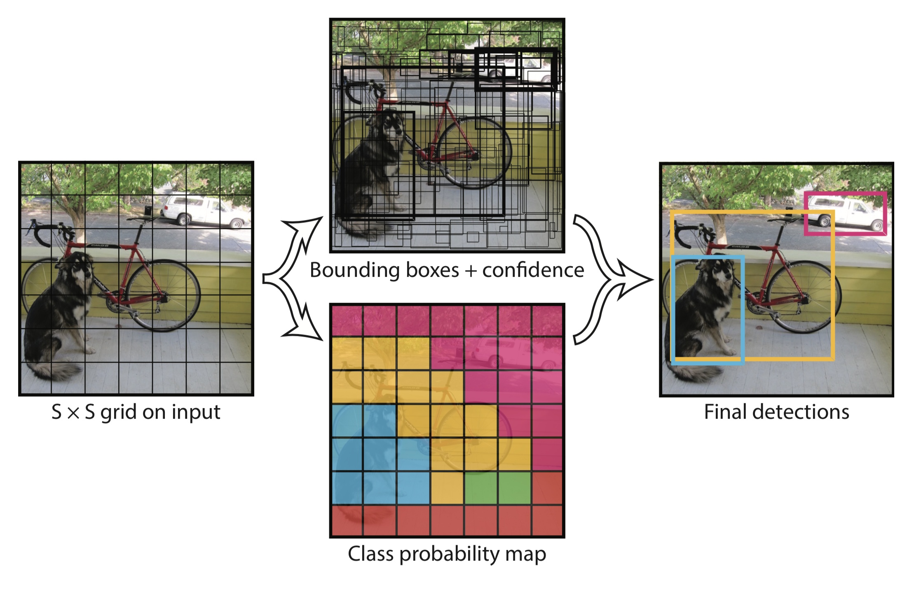
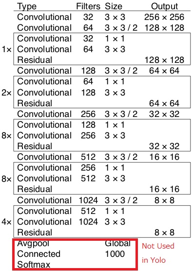
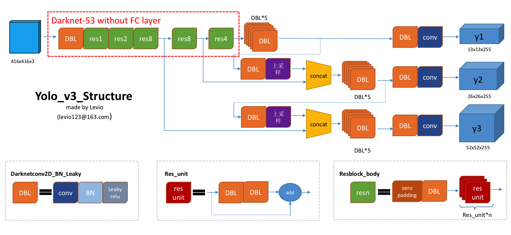

# yolov3

> The object detection problem = a regression problem  
> The image is divided into an S × S grid  
> **If the center of a target falls into a grid, the grid is responsible for detecting the target.**

Each grid will output the followings:  
> Box Co-ordinates : x,y,w,h -> (x,y) is the center of box   
> Objectness Score : IoU score between the predict box and the real box  
> Class Scores.    : object classification score  

Darknet-53 used

Yolo3 Architecture

> Image(416x416) -> 3 different scales(stride 32, 16 and 8) -> detection grid size(13x13, 26x26 and 52x52)  
> 1st detection : 82nd layer(13 x 13 x 255(features))  
> 2nd detection : 94th layer(26 x 26 x 255(features))  <- concatenated (upsampling by 2 (79nd layer + one convolution)) with 61st layer  
> 3rd detection : 106th layer(52 x 52 x 255(features)) <- concatenated (91st layer + one convolution) with 36th layer  

