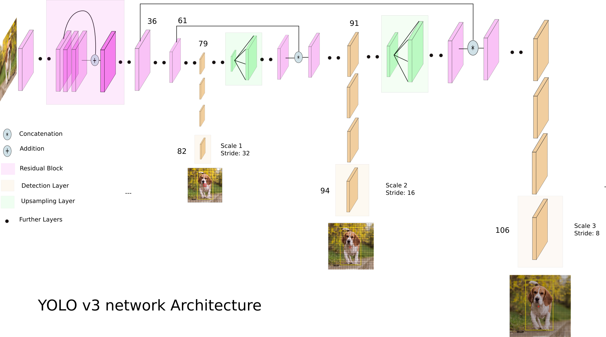

# yolov3

> The object detection problem = a regression problem  
> The image is divided into an S × S grid  
> **If the center of a target falls into a grid, the grid is responsible for detecting the target.**

Each grid will output the followings:  
> Box Co-ordinates : x,y,w,h -> (x,y) is the center of box   
> Objectness Score : IoU score between the predict box and the real box  
> Class Scores.    : object classification score  

Darknet-53 used

Yolo3 Architecture

